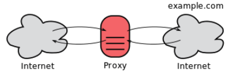
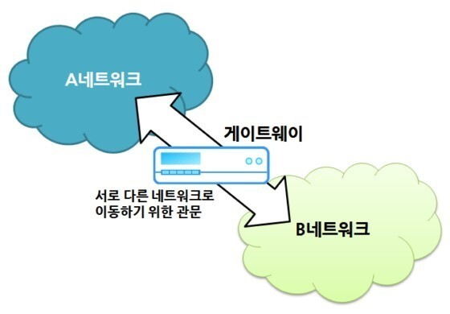

# 5장 HTTP와 연계하는 웹 서버

## 1. 가상 호스트

IP 주소 1개, 즉 서버 1대로 여러가지의 도메인을 활용할 수 있다.

- 이름 기반 가상호스트 ( Name-based virtual host )
- 주소 기반 가상 호스트 ( IP-based virtual host )
- 포트 기반 가상 호스트 ( Port-based virtual host )
- 기본 가상 호스트 ( Default virtual host )

### 이름 기반 가상호스트

호스트 명, 도메인 명으로 여러개의 웹 사이트를 구분을 하여 1개의 서버에서 멀티 도메인을 가능하게 하는 방법

예를 들어서 `www.naver.com` 이 있다면

- 호스트 명: `www`
- 도메인 명: `naver.com`

이렇게 호스트 명을 다르게 이용해서 여러가지의 표현을 할 수 있다. 
- `mail.naver.com`
- `www.naver.com`
- `comic.naver.com`

구분되는 주소를 이용하지만 DNS에 의해서 모두 같은 IP 주소가 반환되어 
서버에 액세스를 하는 경우에 1가지의 서버로 멀티 도메인을 이용할 수 있게 되는 것이다.

    주의할 점은 HTTP request를 요청할 때 호스트명과 도메인 명을 완전하게 포함한
    URI를 지정하거나, 반드시 Host 헤더 필드에서 지정해야 한다.

### Host 헤더

[Host MDN](https://developer.mozilla.org/ko/docs/Web/HTTP/Headers/Host)

Host 요청 헤더는 (가상 호스팅을 위해) 서버의 도메인명과 서버가 리스닝하는 (부가적인) TCP 포트를 특정합니다.

문법

`Host: <host>:<port>`

 

## 2. 통신 중계 프로그램

## 프록시

서버와 클라이언트의 모든 역할을 하는 중계 프로그램이다.

클라이언트로부터의 request를 서버에 전송하고, 서버로부터의 response를 클라이언트에 전송한다.

### 특징
- 클라이언트의 request URI를 변경하지 않고 서버에 보낸다.
- 프록시 서버를 여러대 경유하는 것도 가능
  - 단, 경유할 때마다 "Via" 헤더 필드에 정보를 추가한다.
  
### 주요 사용 방법

캐싱 프록시
- 프록시 서버 상에 리소스 캐시를 보존하는 타입의 프록시다.
- 같은 리소스에 리퀘스트가 온 경우, 오리진 서버에 리소스를 요청하는 것이 아닌, 캐시를 돌려준다.
- 따라서 데이터 전송 시간과 외부 트랙픽이 줄어들고 서버 측의 네트워크 병목 현상을 방지할 수 있다.

투명 프록시
- 메세지 변경을 하지 않는 타입의 프록시다.
- 조직 내에 프록시 서버를 설치하여 특정 웹에 대한 액세스를 제한하거나, 로그를 획득한다.
- 카페는 투명 프록시를 통해 공용 와이파이에서 사용자를 인증하고 액세스 권한을 허용한다.
- 프록시 서버 측에서 위험이 예상되는 웹 콘텐츠 및 악성코드를 필터링 함으로써 보안을 향상시킬 수 있다.

## 게이트웨이

게이트웨이의 동작은 프록시와 유사하지만, 클라이언트의 HTTP 요청을 서버에게 HTTP 프로토콜 이외의 통신을 
사용한다는 점이 차이다.

이때 클라이언트와 게이트웨이 사이을 암호화하여 안전성을 높이는 역할도 한다.

### 주요 사용 방법

인터넷 공유기
- 사용자의 컴퓨터의 네트워크와 인터넷을 연결하여 사용자가 다른 웹에 접근할 수 있도록 한다.
- 사용자가 사용하는 로컬 네트워크의 통신 프로토콜과 인터넷의 통신 프로토콜이 다르기 때문이다.

데이터베이스 SQL
- 로컬 서버 -> 게이트웨이 -> (로컬이 아닌) MySQL 서버

## 터널

다른 서버와의 통신 경로를 확립하여 클라이언트의 request를 해석하지 않고 그대로 다음 서버에 중계한다.
그리고 SSL 같은 암호화 통신을 통해서 서버와 안전하게 통신할 수 있다.

### 주요 사용 방법

개인 노트북에서 회사 네트워크 사용 
- 실제 네트워크 주소가 회사 네트워크의 일부가 아닌 원격 사용자에게 회사 네트워크 주소를 제공 할 수 있다.

 

## 3. 리소스 캐시

캐시는 프록시 서버와 클라이언트의 로컬 디스크에 보관된 리소스의 사본을 가르킨다.
캐시를 사용하면 통신량과 통신 시간을 절약할 수 있다.

### 무엇을 캐싱하나?

HTTP 캐시들은 일반적으로 GET에 대한 응답만을 캐싱하며, 다른 메서드들은 제외된다. 
주요하게 캐시하는 항목들은 다음과 같다.

- HTML 문서, 이미지 혹은 파일과 같은 리소스를 포함하는 GET 요청에 대한 200 (OK) 응답
- 영구적인 리다이렉트: 301 (Moved Permanently) 응답
- 오류 응답: 404 (Not Found) 결과 페이지
- 완전하지 않은 결과: 206 (Partial Content) 응답

### Cache-Control

Cache-Control 헤더를 이용해서 리소스 캐시를 관리할 수 있디.

캐시하지 않음
`Cache-Control: no-store`

캐시하고 만료시간을 지정
`Cache-Control: max-age=31536000`

### 유효성

캐시가 지정한 만료시간이 지난 리소스에 대한 요청을 받았다면, 
이 리소스가 실제로 아직 유효한지 아닌지를 확인하기 위해 서버에 검증 요청을 전달한다.

만약 리소스가 변경이 있어서, 새로운 데이터가 필요한 경우 데이터를 갱신해준다.
그러나 만약에 새로 갱신할 필요가 없다면, 서버는 요청된 리소스 본문을 전송하지 않고 304 (Not Modified) 헤더를 돌려보내 대역폭을 절약한다.

### 클라이언트 캐시

인터넷 임시 파일이라고 불리우는 클라이언트가 보존하는 캐시가 있다.
대부분은 정적 컨텐츠(이미지, JS, CSS 등)을 로컬 디스크에 저장하여 같은 리소스에 경우에는
서버에 액세스하지 않고 로컬 디스크로 부터 불러온다.

 

## 4. HTTP가 등장하기 이전의 프로토콜

### FTP

파일을 전송할 때 사용되는 프로토콜이다. 
주로 웹 개발 시 파일 업로드, 이미지 파일 추가 등의 작업을 수월하게 처리할 수 있다.
하지만 오래전에 나온 기술로 암호화를 사용하지 않아 보안에 약하기 때문에, FTP에 대한
지원이 점점 줄어드는 추세이다.
