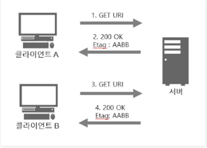
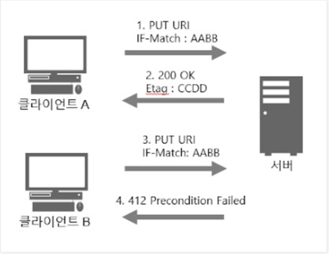

## 리퀘스트 헤더 필드

- 클라이언트 측에서 서버 측으로 송신된 리퀘스트 메세지에 사용되는 헤더
- 리퀘스트의 부가 정보, 클라이언트 정보, 리스폰스 컨텐츠 타입 우선 순위 등(네고시에이션)

### Accept
- 클라이언트가 이해 가능한 미디어 타입 제공
- 하나만 지정할 수도, 와일드 카드를 지정할 수도, 품질 값으로 컨텐츠 협상도 가능

#### 디렉티브
- <MIME_type>/<MIME_subtype>
  - text/html
- <MIME_type>/*
  - image/* -> image/png, image/svg, image/gif 이외에도 모든 image 타입과도 일치
- \*/*
  - 모든 미디어 타입
- ;q=
  - 품질 값(0~1 사이의 값)

#### 예시
- Accept: text/html

- Accept: image/*

- Accept: text/html, application/xhtml+xml, application/xml;q=0.9, */*;q=0.8

### Accept-Charset
- 클라이언트가 이해 가능한 문자셋 제공
- 브라우저들은 각각의 컨텐츠 타입에 대한 기본 값이 일반적으로 정확하고 그것을 전송하는 것이 더 쉽게 행적을 남기게 될 가능성이 있으므로 이 헤더를 설정하지 않습니다.

서버가 일치하는 캐릭터셋을 서브하지 못할 경우, 이론적으로 406 (en-US) (Not Acceptable) 오류 코드를 회신할 수 있습니다. 그러나, 더 나은 사용자 경험을 위해, 그런 경우는 드물며 더 일반적인 방법은 이런 경우 Accept-Charset 헤더를 무시하는 겁니다.

HTTP/1.1 초기 버전에서는, 기본 캐릭터셋(ISO-8859-1)이 정의됐었습니다. 더 이상 실제로 그렇지 않으며 이제 각각의 컨텐츠 타입이 기본 값을 가지고 있을 수도 있습니다.

### Accept-Encoding
- 클라이언트가 이해 가능한 인코딩 제공

#### 종류
- gzip
- deflate
- br
- compress
- identity
  - 압축과 변환을 하지 않은 디폴트 코딩

#### TMI
- Chrome 과 Safari 는 Accept-Encoding 으로 gzip, deflate, br 이 설정되어 있다.

### Accept-Language
- 클라이언트가 이해 가능한 언어 제공
- 서버에서 제공할 수 있는 언어가 없어도 무관

### Authorization
- User Agent 의 인증 정보를 전달하기 위해 사용됨
- 보통 401 이후에 사용

### From
- 유저 에이전트 연락처 정보를 등록

#### WHY??
- 크롤러와 같은 로보틱 사용자 에이전트를 실행하고 있다면,  From 헤더를 반드시 전송

### Host
- 요청한 리소스의 호스트와 포트 번호 등이 나타남
- http/1.1 에서 유일한 필수 헤더 필드

### If-Match
- If-Match 의 값과 서버의 특정 Etag 값이 같다면 요청을 받아들이는 용도

1. A와 B가 Etag 가 "AABB" 인 리소스를 요청하면 같은 리소스를 반환

1. A가 "AABB" 인 리소스를 "CCDD" 로 수정
2. B가 가지고 있던 "AABB" 리소스에 대한 정보는 서버에서 사라지고 412 코드를 응답받음

### If-Modified-Since
- 필드값에 지정된 날짜 값 이후로 갱신된 리소스를 요청하고, 있다면 반환받음
- 없다면 304 Not Modified 코드

### If-None-Match
- If-Match 와 반대로 동작

### If-Unmodified-Since
- If-Modified-Since 와 반대로 동작

### Proxy-Authorization
- 프록시 서버에서의 인증 요구를 받아들일 때에 인증에 필요한 정보를 전달 
- 클라이언트와 프록시 서버 사이의 인증

### Range
- 리소스의 일부만 요구할 때
- 상태 코드는 206 Partial Content

#### 구조
`Range: byte=5001-10000`

### Referer
- Request 가 발생한 본래의 리소스 주소
- 보통 하이퍼링크로 이동할 때 발생
- 주소창에서 직접 URI 입력 시 보안상의 이유로 해당 헤더 전달 X

#### TMI
- 문법상 Referrer 철자가 맞지만 처음에 잘못 사용된 Referer 로 계속 사용

### User-Agent

- 요청을 보낸 브라우저의 정보

#### 구조
`User-Agent: <product> / <product-version> <comment>`

우리가 User Agent 를 볼 수 있는 곳

#### Chrome
`user-agent: Mozilla/5.0 (Macintosh; Intel Mac OS X 10_15_7) AppleWebKit/537.36 (KHTML, like Gecko) Chrome/100.0.4896.127 Safari/537.36`

- Gecko: 렌더링 엔진

#### Safari
`user-agent: Mozilla/5.0 (Macintosh; Intel Mac OS X 10_15_7) AppleWebKit/605.1.15 (KHTML, like Gecko) Version/14.1.2 Safari/605.1.15`

#### Postman
`user-agent: PostmanRuntime/7.29.0`

#### curl
`user-agent: curl/7.64.1`