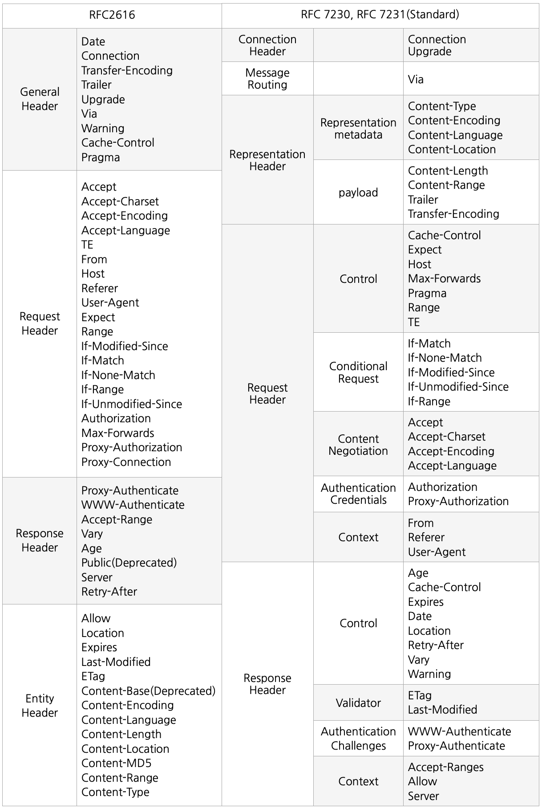

## 새로운 HTTP 1.1 표준

- 1999년 RFC2616 -> 폐기
- 2014년 RFC7230~7235 등장



```text
HTTP/1.1 200 OK

Content-Type: text/html;charset=UTF-8 Content-Length: 3423 -> 표현헤더

<html> 
    <body>...</body>
</html>
-> 메세지 본문 : 표현데이터를 담고있음
```

## 표현 헤더 필드

- RFC 7231 섹션 3에서, 엔티티라는 명칭에서 Representation(표현)으로 변경.
    - (다만, 개념이 동일하지는 않음)
- Representation(표현)도 더 자세하게 분리
    - Representation = representation Metadata + Representation Data
    - 표현 = 표현 메타데이터(representation Metadata) + 표현 데이터(Representation Data)

## 페이로드

- 메시지 본문(message body)을 통해 표현 데이터 전달
- 메시지 본문 = 페이로드(payload)

## 표현

- 표현 : 요청이나 응답에서 전달할 실제 데이터
- 표현 헤더 : 메세지 본문(페이로드) 속 표현 데이터들을 해석할 수 있는 정보 제공

## 표현 메타데이터 필드

- [Content-Type](https://developer.mozilla.org/en-US/docs/Web/HTTP/Headers/Content-Type) : 리소스(표현 데이터)의 미디어 타입(**MIME
  types (IANA media types)**)을 나타내기 위해 사용. 필드값은 “타입/서브타입” 형태. 이후 charset은 문자셋(UTF-8 등) 지정.

    ```
    Content-Type: text/html; charset=UTF-8
    Content-Type: multipart/form-data; boundary=something
    ```

- [Content-Encoding](https://developer.mozilla.org/en-US/docs/Web/HTTP/Headers/Content-Encoding) : 표현 데이터를 압축할 때 인코딩 방식

    ```
    Content-Encoding: gzip
    Content-Encoding: compress
    Content-Encoding: deflate
    Content-Encoding: br
    ```

- [Content-Language](https://developer.mozilla.org/en-US/docs/Web/HTTP/Headers/Content-Language) : 표현 데이터의 자연 언어

    ```
    Content-Language: ko
    Content-Language: en-US
    Content-Language: de-DE, en-CA
    ```

- [Content-Location](https://developer.mozilla.org/en-US/docs/Web/HTTP/Headers/Content-Location) : 표현 데이터에 대응되는 URI 전달.
  Location과 다르다. 실제 주소에 액세스해 돌아온 URI가 다를때 표시한다.

    ```
    HTTP/1.1 201 Created
    Content-Type: text/markdown
    Content-Location: /my-first-blog-post
    
    # My first blog post
    
    I made this through `example.com`'s API. I hope it worked.
    ```

- 왜 페이로드 헤더 안다룸 ? →선택적으로 사용되기 때문..
- 자세한건 RFC 7231 참고

## 참고문헌

- [mdn web docs - HTTP]([https://developer.mozilla.org/en-US/docs/Web/HTTP](https://developer.mozilla.org/en-US/docs/Web/HTTP))
- [httpwg - RFC 7231]([https://httpwg.org/specs/rfc7230.html#RFC7231](https://httpwg.org/specs/rfc7230.html#RFC7231))
